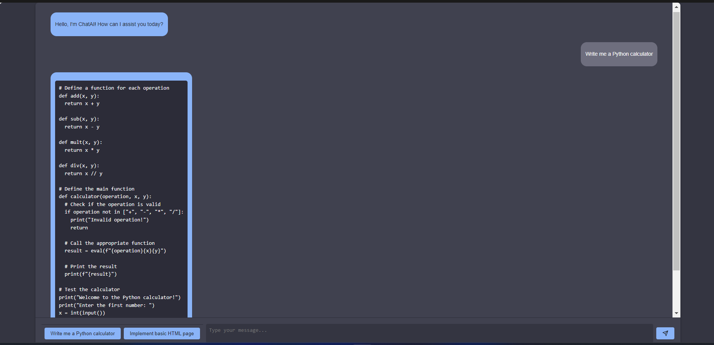

# 3D Stunning Presentations Template for Web Developers

This project offers a captivating 3D web application that presents insightful narratives about web developers, covering aspects such as salaries, top earners, perspectives, and even features an interactive chat with LLAMA.

## Features

- **Immersive 3D Visualizations**: Present data in a visually stunning manner using Three.js.
- **Engaging Chat Experience**: Interact with users through a chat feature powered by the LLAMA API.
- **Insights into Salaries and Perspectives**: Dive into sections detailing web developer salaries, top earners, and industry perspectives.
- **Component-based Architecture with Vue.js**: Built with Vue.js, facilitating easy maintenance and extensibility through a component-based approach.


<div align="center">





</div


### Installation


1. **Clone the Repository**:
```git clone https://github.com/yourusername/yourrepository.git```

2. **Install Dependencies**:
Navigate to the project directory and install the necessary dependencies.

```cd yourrepository```
```npm install```


3. **Obtain LLAMA API Key**:
To enable the chat feature, you'll need an API key from LLAMA.
- Visit the [LLAMA API website](https://www.llama-api.com/) and create an account.
- Generate an API key from your account dashboard.


4. **Run the Application**:
Initiate the development server to experience the application firsthand.

```npm run dev```

## Contributing

Contributions are greatly appreciated!

## License

This project is licensed under the terms of the MIT License. See the [LICENSE](LICENSE) file for more information.